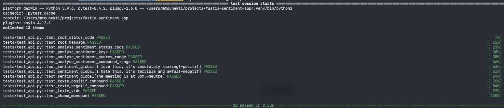
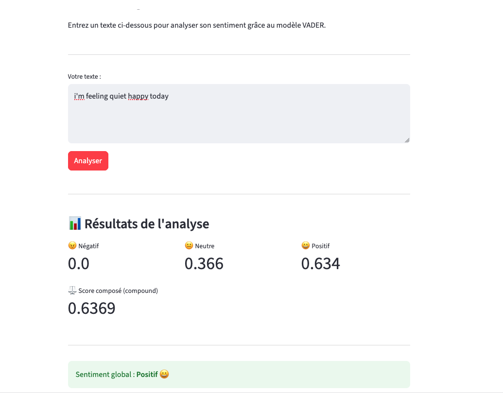

# 🧠 FastIA — Analyseur de Sentiment

Application web d'analyse de sentiment intégrant un modèle d'IA (NLTK VADER), une API FastAPI et une interface utilisateur Streamlit.

---

## 📋 Description

Cette application permet d'analyser le sentiment d'un texte saisi par l'utilisateur. Elle retourne les scores de polarité (positif, négatif, neutre) ainsi qu'un score global composé, avec une interprétation visuelle du sentiment détecté.

Le modèle utilisé est **VADER** (Valence Aware Dictionary and sEntiment Reasoner) de la bibliothèque NLTK.

---

## 🏗️ Architecture

```
fastia-sentiment-app/
├── .venv/                  ← environnement virtuel (non versionné)
├── api.py                  ← serveur FastAPI (modèle IA + routes)
├── app.py                  ← interface utilisateur Streamlit
├── requirements.txt        ← dépendances du projet
├── .gitignore              ← exclut .venv et fichiers inutiles
└── README.md               ← documentation du projet
```

### Fonctionnement

```
Utilisateur
    │
    ▼
[ Streamlit - app.py ]        → interface web (port 8501)
    │  requête HTTP POST
    ▼
[ FastAPI - api.py ]          → API REST (port 9000)
    │  appel du modèle
    ▼
[ NLTK VADER ]                → analyse de sentiment
    │  scores neg/neu/pos/compound
    ▼
[ Streamlit - app.py ]        → affichage des résultats
```

---

## ⚙️ Installation

### Prérequis

- Python 3.9+
- Git

### 1. Cloner le dépôt

```bash
git clone https://github.com/TON_USERNAME/fastia-sentiment-app.git
cd fastia-sentiment-app
```

### 2. Créer et activer l'environnement virtuel

```bash
python -m venv .venv
```

```bash
# macOS / Linux
source .venv/bin/activate

# Windows
.venv\Scripts\activate
```

### 3. Installer les dépendances

```bash
pip install -r requirements.txt
```

### 4. Télécharger le lexique VADER

```bash
python -c "import nltk; nltk.download('vader_lexicon')"
```

---

## 🚀 Lancement

L'application nécessite **deux terminaux** ouverts simultanément.

### Terminal 1 — Lancer l'API FastAPI

```bash
uvicorn api:app --reload --port 9000
```

L'API est accessible sur : [http://127.0.0.1:9000](http://127.0.0.1:9000)  
Documentation interactive : [http://127.0.0.1:9000/docs](http://127.0.0.1:9000/docs)

### Terminal 2 — Lancer l'interface Streamlit

```bash
streamlit run app.py ( source .venv/bin/activate -> streamlit run app.py )
```

L'interface est accessible sur : [http://localhost:8501](http://localhost:8501)

---

## 🛣️ Routes de l'API

| Méthode | Route | Description |
|---------|-------|-------------|
| `GET` | `/` | Message de bienvenue, vérifie que l'API est en ligne |
| `POST` | `/analyse_sentiment/` | Analyse le sentiment d'un texte |

### Détail de la route POST `/analyse_sentiment/`

**Corps de la requête (JSON) :**

```json
{
  "texte": "J'adore ce projet, c'est vraiment passionnant !"
}
```

**Réponse (JSON) :**

```json
{
  "neg": 0.0,
  "neu": 0.354,
  "pos": 0.646,
  "compound": 0.765
}
```

**Interprétation du score `compound` :**

| Valeur | Sentiment |
|--------|-----------|
| `>= 0.05` | Positif 😀 |
| `<= -0.05` | Négatif 🙁 |
| Entre les deux | Neutre 😐 |

---

## 📦 Dépendances

```
fastapi
uvicorn
streamlit
requests
nltk
pydantic
loguru
```

> Toutes les dépendances sont listées dans `requirements.txt`.

---

## 📝 Journalisation

L'application utilise **Loguru** pour la journalisation côté API et côté Streamlit. Les logs enregistrent les textes analysés, les résultats et les erreurs éventuelles.

---

## 🧪 Tests (Bonus)

Des tests unitaires sont disponibles avec **Pytest** pour valider les routes de l'API.


```bash
pytest
```


---

## 👤 Auteur

Projet réalisé dans le cadre de la formation **FastIA** — Module 0, Brief 1 - by Maroua Tounekti
